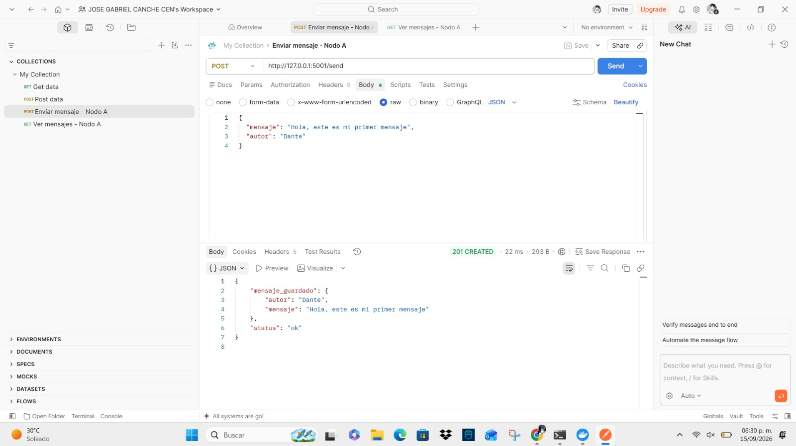
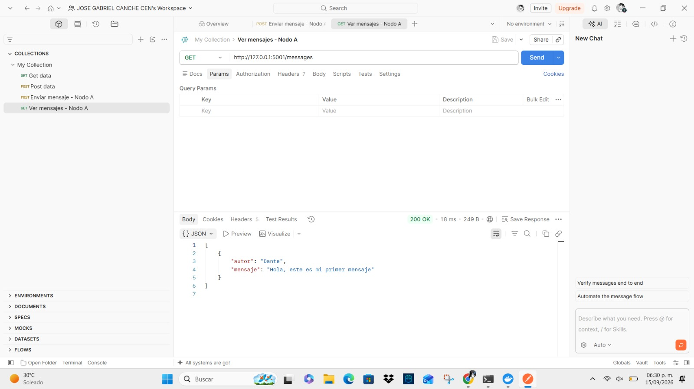

# Evidencia de funcionamiento del primer nodo

Este documento contiene la evidencia del funcionamiento correcto del primer nodo del sistema NodeMesh, correspondiente al modelo cliente-servidor básico antes de incorporar la replicación entre múltiples nodos.

Las pruebas se realizaron utilizando **Postman** como cliente, enviando peticiones HTTP directamente al servidor Flask que corre en el puerto 5001.

---

## 1. Envío de un mensaje nuevo (POST /send)

El primer paso consiste en verificar que el nodo puede recibir un mensaje nuevo y almacenarlo correctamente.

**Petición enviada:**

- Método: `POST`
- URL: `http://127.0.0.1:5001/send`
- Cuerpo (JSON):

```json
{
  "mensaje": "Hola, este es mi primer mensaje",
  "autor": "Dante"
}
```

**Captura de la petición y respuesta:**



**Resultado obtenido:**

```json
{
    "mensaje_guardado": {
        "autor": "Dante",
        "mensaje": "Hola, este es mi primer mensaje"
    },
    "status": "ok"
}
```

**Interpretación del resultado:**

El servidor respondió con un código de estado **201 Created**, que en el protocolo HTTP indica que un nuevo recurso fue creado exitosamente. Esto confirma que el endpoint `/send` procesó correctamente los datos recibidos, los almacenó en la lista de mensajes del nodo, y devolvió una confirmación junto con el contenido guardado.

---

## 2. Consulta de mensajes almacenados (GET /messages)

El segundo paso consiste en verificar que el nodo puede devolver correctamente los mensajes que tiene almacenados, incluyendo el mensaje enviado en el paso anterior.

**Petición enviada:**

- Método: `GET`
- URL: `http://127.0.0.1:5001/messages`

**Captura de la petición y respuesta:**



**Resultado obtenido:**

```json
[
    {
        "autor": "Dante",
        "mensaje": "Hola, este es mi primer mensaje"
    }
]
```

**Interpretación del resultado:**

El servidor respondió con un código de estado **200 OK**, indicando que la solicitud se procesó correctamente. El cuerpo de la respuesta contiene un arreglo con el mensaje previamente enviado, confirmando que el nodo mantiene en memoria la información recibida y es capaz de devolverla cuando se le solicita.

---

## 3. Conclusión de la prueba

Con estas dos pruebas se valida el funcionamiento básico del modelo cliente-servidor en un solo nodo:

- El nodo **recibe y almacena** información correctamente (`POST /send`).
- El nodo **devuelve** la información almacenada cuando se le consulta (`GET /messages`).

Este comportamiento constituye la base sobre la cual se construye posteriormente la replicación de mensajes entre múltiples nodos, que se documenta en una etapa posterior del proyecto.
